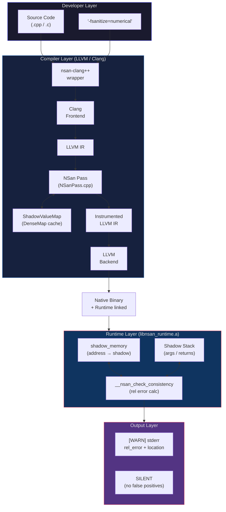
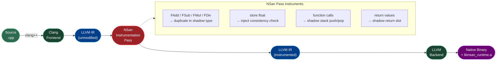
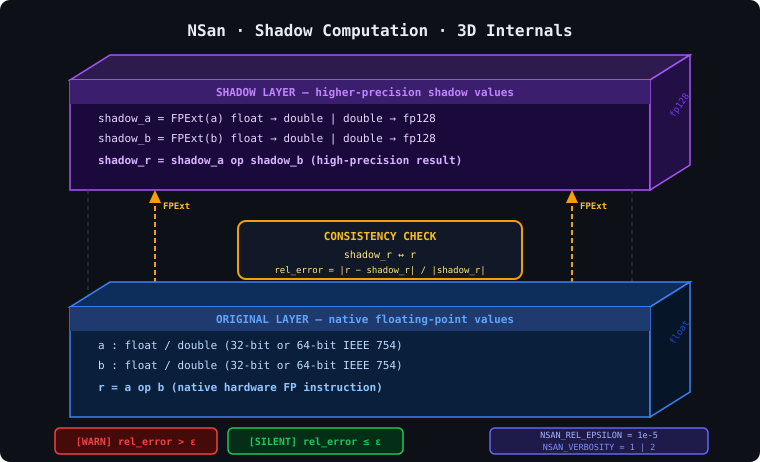
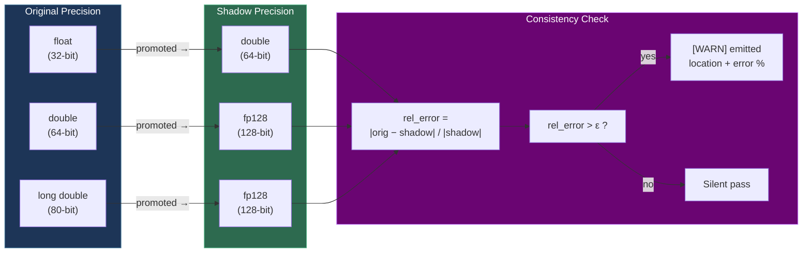
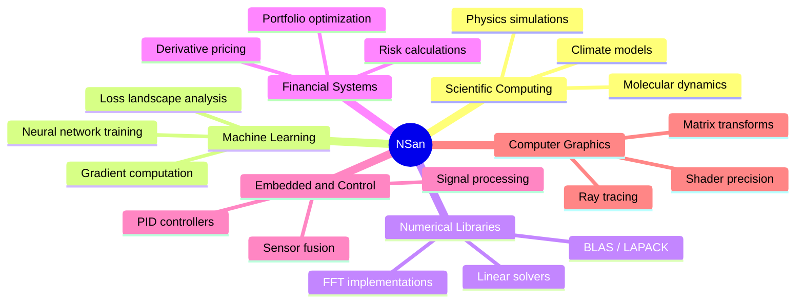

<div align="center">

# NSan — Numerical Stability Sanitizer

**An LLVM compiler plugin that automatically detects floating-point precision bugs at compile time.**

[](https://en.cppreference.com/)
[](https://llvm.org/)
[](https://cmake.org/)
[](LICENSE)
[](tests/)

> *"Find numerical instabilities before they find you."*

</div>

---

## What is NSan?

NSan instruments your C/C++ program at compile time. Every floating-point operation gets a **shadow twin** running in parallel at higher precision. When the two diverge past a configurable threshold, NSan reports exactly where, what the error is, and by how much — without changing a single line of your source code.

---

## Architecture — 3D System View



---

## Compilation Pipeline



---

## Shadow Value System — 3D Internals

<p align="center">
  
</p>



---

## Project Structure

```
CD_Lab_EL_Team_Assignment_21/
│
├── README.md               ← you are here
├── DESIGN.md               ← approach + alternatives
├── IMPLEMENTATION.md       ← LLVM pass internals
├── EVALUATION.md           ← benchmark results + test case analysis
├── DEMO.md                 ← demo video / screenshots
│
├── nsan-clang++            ← compiler wrapper (-fsanitize=numerical)
├── build.sh                ← one-shot build script
├── run.sh                  ← test runner
├── benchmark.sh            ← performance benchmarking
│
├── src/
│   ├── nsan/
│   │   ├── NSanPass.cpp        ← LLVM function pass (core instrumentation)
│   │   ├── NSanPass.h
│   │   ├── ShadowValueMap.cpp  ← DenseMap: Value* → shadow Value*
│   │   └── ShadowValueMap.h
│   └── runtime/
│       ├── nsan_runtime.cpp    ← __nsan_check_consistency + shadow stack
│       ├── nsan_runtime.h
│       ├── shadow_memory.cpp   ← address → shadow memory mapping
│       └── shadow_memory.h
│
├── include/
│   ├── nsan.h                  ← public API
│   ├── nsan_interface.h
│   └── internal/
│       ├── configuration.h
│       └── shadow_tracking.h
│
└── tests/
    ├── tc1_cancellation.cpp    ← catastrophic cancellation
    ├── tc2_naive_sum.cpp        ← naive summation drift
    ├── tc3_kahan.cpp            ← Kahan (no false positive)
    ├── tc4_alternating.cpp      ← alternating harmonic series
    ├── tc5_poly.cpp             ← polynomial near root
    ├── tc6_newton.cpp           ← Newton's method
    ├── tc7_variance.cpp         ← one-pass variance
    ├── tc8_exact_sum.cpp        ← exact summation
    ├── tc9_fma.cpp              ← FMA cancellation
    ├── tc10_sigmoid.cpp         ← sigmoid instability
    ├── tc11_mixed_dot.cpp       ← mixed-precision dot product
    └── tc12_newton_sqrt.cpp     ← Newton sqrt convergence
```

---

## Tool Stack

| Layer | Tool | Role |
|-------|------|------|
| **Compiler** | `clang++` / LLVM 10+ | Parses C/C++, emits LLVM IR |
| **Pass** | `NSanPass` (New Pass Manager) | Instruments every FP instruction |
| **Shadow Map** | `ShadowValueMap` (DenseMap) | Tracks `Value* → shadow Value*` locally |
| **Runtime** | `libnsan_runtime.a` | Consistency checks, shadow memory, shadow stack |
| **Wrapper** | `nsan-clang++` shell script | Translates `-fsanitize=numerical` to pass flags |
| **Build** | CMake 3.12+, C++17 | Builds pass shared lib + runtime static lib |
| **Test Runner** | `run.sh` | Compiles and runs all 12 test cases |
| **Benchmark** | `benchmark.sh` | Measures overhead across 5 representative cases |

---

## Performance — Why NSan Wins

| Tool | Mechanism | Overhead | Multi-thread? | False Positives |
|------|-----------|----------|---------------|-----------------|
| **NSan (double shadow)** | LLVM pass, native hw | **2 – 4×** | Yes | Low (observable only) |
| **NSan (quad shadow)** | LLVM pass, fp128 hw | **~17×** | Yes | Low |
| Verificarlo (MCA) | Stochastic, 1000× reruns | ~40,000× | No | High |
| FpDebug / Valgrind | Binary instrumentation | ~476× | No | Medium |
| Manual Analysis | Human effort | infinite | — | Variable |

> NSan is **1–4 orders of magnitude faster** than the nearest alternative while providing deterministic, source-accurate diagnostics.

---

## Test Case Results

| # | Test | Numerical Pattern | NSan Result | Expected |
|---|------|-------------------|-------------|----------|
| TC1 | `tc1_cancellation.cpp` | `(1e7 + 1.234) − 1e7` | `[WARN] rel=1.90e-01` | WARN |
| TC2 | `tc2_naive_sum.cpp` | Sum `0.1f` × 1,000,000 | `[WARN] rel=9.58e-03` | WARN |
| TC3 | `tc3_kahan.cpp` | Kahan compensated sum | **SILENT** | Silent |
| TC4 | `tc4_alternating.cpp` | Alternating harmonic series | `[WARN] rel=1.06e-05` | WARN |
| TC5 | `tc5_poly.cpp` | Poly near root `x=1` | `[WARN]` | WARN |
| TC6 | `tc6_newton.cpp` | Newton's method | `[WARN]` | WARN |
| TC7 | `tc7_variance.cpp` | One-pass variance | `[WARN] rel=4.54e+04` | WARN |
| TC8 | `tc8_exact_sum.cpp` | Exact summation | **SILENT** | Silent |
| TC9 | `tc9_fma.cpp` | FMA near-zero | `[WARN] rel=8.22e+05` | WARN |
| TC10 | `tc10_sigmoid.cpp` | Sigmoid instability | `[WARN]` | WARN |
| TC11 | `tc11_mixed_dot.cpp` | Mixed-precision dot product | `[WARN]` | WARN |
| TC12 | `tc12_newton_sqrt.cpp` | Newton sqrt convergence | `[WARN]` | WARN |

> TC3 and TC8 deliberately produce **no warnings** — validating NSan's false-positive suppression.

---

## Quick Start

### Prerequisites

```bash
# Ubuntu / Debian
sudo apt-get install llvm-dev clang cmake build-essential

# macOS
brew install llvm cmake
```

### Build

```bash
git clone https://github.com/pvjambur/CD_Lab_EL_Team_Assignment_21.git
cd CD_Lab_EL_Team_Assignment_21
./build.sh
```

### Run All Tests

```bash
./run.sh
```

### Instrument Your Own Code

```bash
# Compile with NSan
./nsan-clang++ -fsanitize=numerical my_program.cpp -o my_program

# Run — precision errors surface immediately
./my_program

# Tune tolerance
NSAN_REL_EPSILON=1e-6 ./my_program

# Increase verbosity
NSAN_VERBOSITY=2 ./my_program
```

### Benchmark Overhead

```bash
./benchmark.sh   # compares instrumented vs baseline on tc1–tc4, tc7
```

---

## Runtime Controls

| Environment Variable | Default | Description |
|----------------------|---------|-------------|
| `NSAN_REL_EPSILON` | `1e-5` | Relative error threshold for `[WARN]` |
| `NSAN_EPSILON` | — | Absolute error threshold (alternative) |
| `NSAN_VERBOSITY` | `1` | `1` = warnings only, `2` = full shadow trace |

---

## Use Cases



---

## References

- Courbet, C. (2021). *NSan: A Floating-Point Numerical Sanitizer*. CC '21 — ACM SIGPLAN International Conference on Compiler Construction.
- IEEE 754-2019 — Floating-point arithmetic standard.
- Higham, N. J. (2002). *Accuracy and Stability of Numerical Algorithms* (2nd ed.). SIAM.
- [LLVM Sanitizer Framework](https://clang.llvm.org/docs/Sanitizers/)
- [Verificarlo](https://github.com/verificarlo/verificarlo)

---

<div align="center">

**CD Lab — EL Team Assignment 21** | Compiler Design | 2026

*Built on LLVM. Inspired by the CC '21 paper. Implemented from scratch.*

</div>
