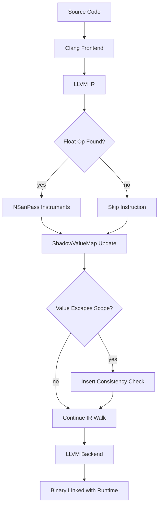
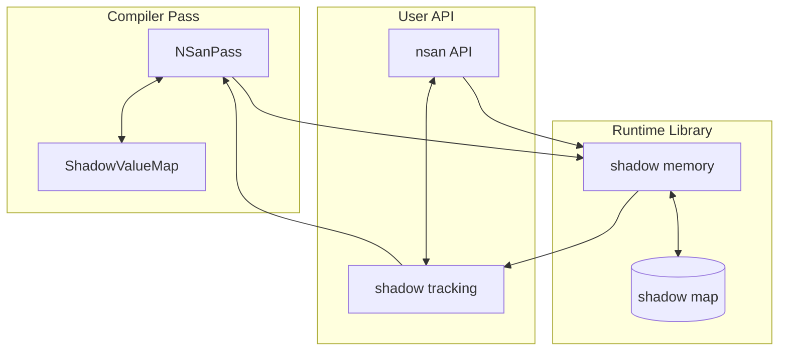
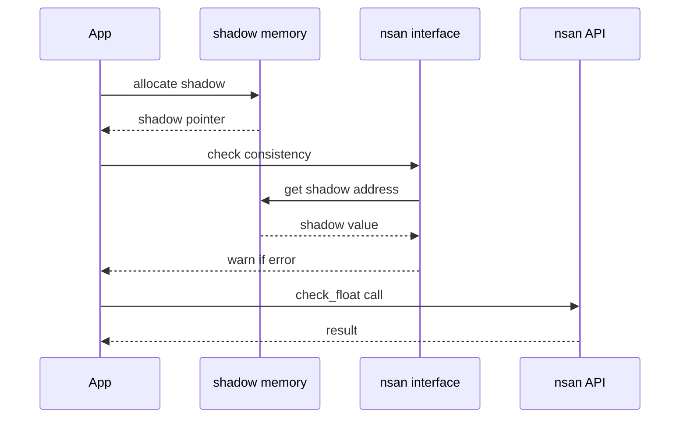

# NSan — Lab Manual

## Aim

NSan is an LLVM compiler plugin that detects floating-point numerical instability in C/C++ programs. It solves the problem that standard debuggers cannot identify precision loss, because they have no model of what a correct floating-point result should be. Compiler authors, numerical library developers, and scientific computing researchers use it to find precision bugs at compile time and runtime without manual mathematical analysis.

---

## Objectives

- **Instrument LLVM IR at the function level** — `NSanPass.cpp` registers an LLVM `FunctionPass` that walks every instruction in a compiled function. It identifies floating-point binary operations such as fadd, fsub, fmul, and fdiv, then inserts a parallel shadow operation at one precision level higher. The pass registers with LLVM via `RegisterPass<NSanPass>` under the name "nsan".

- **Map original values to shadow counterparts** — `ShadowValueMap.cpp` maintains the correspondence between each original LLVM IR value and its higher-precision shadow. `NSanPass` queries this map via `getShadowValue` and updates it via `mapShadowValue` as each instruction is processed, propagating shadows across the entire function body.

- **Manage heap shadow memory at runtime** — `shadow_memory.cpp` implements three C-linkage functions: `__nsan_allocate_shadow`, `__nsan_deallocate_shadow`, and `__nsan_get_shadow_address`. These maintain a `shadow_memory_map` that pairs each heap address with a shadow allocation twice the original size, providing room for double-precision expansion of every float stored on the heap.

- **Track per-byte shadow type to handle type punning** — `shadow_tracking.h` defines the `ShadowType` enum with values `UNKNOWN`, `FLOAT_START`, and `DOUBLE_START`. One byte of type information is recorded for each byte of original memory. When integer writes overwrite a float address, the affected bytes are marked `UNKNOWN`, and the runtime re-extends from the original value rather than comparing against a stale shadow.

- **Expose an explicit user-facing check API** — `nsan.h` declares three public functions: `__nsan_check_float` for on-demand consistency checks, `__nsan_dump_shadow_mem` for inspecting shadow memory during debugging, and `__nsan_resume_float` for resetting shadow propagation from a trusted original value.

---

## Flowchart — Execution Pipeline

---

## Architecture Diagram — System Design

---

## Sequence Diagram — Component Interaction

---

## MVP — What This Proposes

NSan differs from existing tools in one fundamental way: it runs a single instrumented pass rather than thousands of perturbed executions. Verificarlo reruns the program 1000 times with stochastic rounding perturbations, adding 40,000x total overhead. FpDebug relies on Valgrind and serialises all threads. NSan instead inserts a native double-precision shadow alongside each float operation in the LLVM IR, keeping the entire analysis inside a single run at near-hardware speed.

- **Single-run shadow computation** — `NSanPass.cpp` inserts a shadow `fadd double` for every original `fadd float` it finds. Because modern CPUs execute double-precision natively, the shadow adds roughly 2-3x overhead rather than the 40,000x total that Verificarlo requires for a complete analysis run. The shadow result and the original result are compared only at function boundaries, not at every intermediate step.

- **Observable-value checking only** — The pass inserts `__nsan_check_consistency_float` calls only at points where values escape a function — returns handled by `instrumentReturnValue` and call sites handled by `instrumentFunctionCall`, both in `NSanPass.cpp`. Restricting checks to observable values removes the majority of false positives that come from comparing every internal temporary.

- **Type-punning resilience** — `shadow_tracking.h` provides the `ShadowType` enum, and `shadow_memory.cpp` records one type byte per original byte inside `shadow_memory_map`. When `__nsan_get_shadow_address` finds an `UNKNOWN` tag, it knows the shadow is stale and forces re-extension from the current original. No other open-source float sanitizer tracks shadow validity at byte granularity.

- **Thread-safe parameter passing** — The design in `INSTRUCTIONS.md` specifies thread-local storage for the shadow stack that carries function parameters and return values across call boundaries. This contrasts with Valgrind-based tools, which serialise threads and cannot instrument multi-threaded programs at scale. Each thread maintains its own shadow copy, keeping parameter shadows coherent under concurrent execution.

---

## Application and Conclusion

### Applications

- A developer testing a linear solver sets `NSAN_EPSILON=1e-5` and runs the test suite; `__nsan_check_consistency_float` identifies the exact return site in Gaussian elimination where pivot cancellation exceeds the threshold.

- A scientific simulation team integrates NSan into their CI pipeline using `NSAN_VERBOSITY=2`; any commit that introduces a shadow divergence regression fails the build before it reaches production.

- A developer debugging matrix operations calls `__nsan_dump_shadow_mem` on a 3x3 float array to compare its shadow bytes against original values and trace which determinant subtraction introduces near-total cancellation.

- A numerical library author uses `__nsan_resume_float` inside a known-imprecise legacy function to drop the stale shadow and restart precision tracking from the corrected output, preventing cascading false warnings in downstream computations.

### Conclusion

NSan compiles floating-point programs into binaries that carry a parallel double-precision shadow and check for divergence at function boundaries. The current codebase has `NSanPass` registered with LLVM and `shadow_memory.cpp` providing working allocation and lookup via `__nsan_allocate_shadow` and `__nsan_get_shadow_address`, but the core instrumentation methods (`instrumentBinaryOp`, `instrumentFunctionEntry`, `instrumentReturnValue`) remain as Phase 1 TODOs inside `NSanPass.cpp`. The test suite is also a stub, with `tests/CMakeLists.txt` noting that test targets will be added once source files are implemented. Future scope includes completing the five implementation phases in `INSTRUCTIONS.md`, building the `diagnostics.cpp` error reporting module, and populating `tests/benchmarks/` to verify the target 2-20x overhead range.
